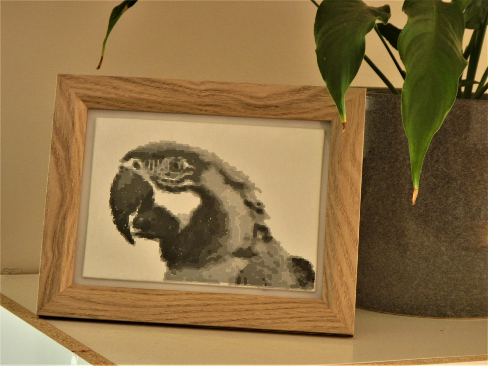
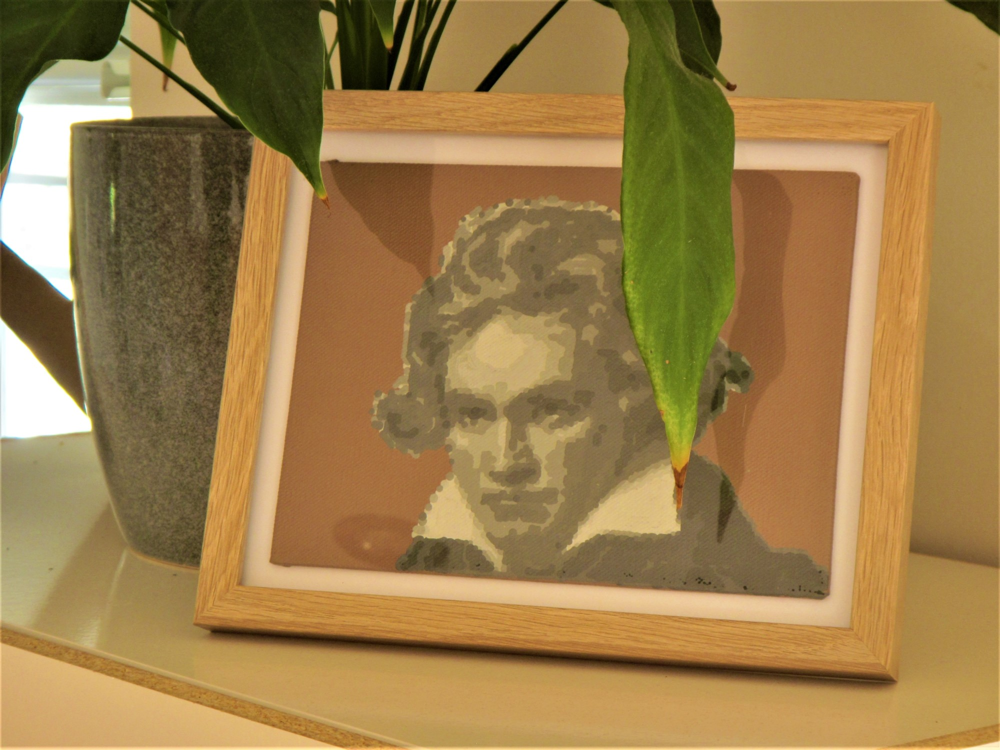

---
title: Home
layout: default
filename: index
order: 1
--- 

# MazingPaints

## Where did this come from and what is it?

This is the webpage for a project to blend digital painting with real-life brush 
on canvas painting.

I started working on this out of curiosity, a bit of covid-19 lockdown 
boredom, and wanting to spice up my home with a bit of extra color. I am 
unsure if I would call this a tech project or an art project so will just call
it *"a project"*.   
   
## A few details...

The concept for this project is to use photos as templates for digital painting 
followed by conversion of these paintings to real-life using brushes attached
to a modified 3D printer. 

Many small things can affect how the final painted canvas looks. For example, 
the template image, paint texture, brush size, and changes to the digital 
painting software all affect the final result. 

The fun part of this project is exploring how the different pieces can be used 
to create interesting and inspiring paintings.
   
*Hope you enjoy :)*   
   
Designer: David Ashton   

  
   

  
   

