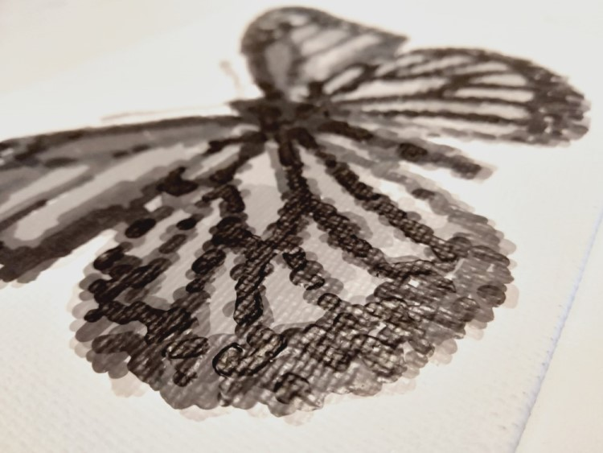

---
title: Home
layout: default
filename: index
order: 1
--- 

  
  

  

## MazingPaints
   
This is the website for an experimental project attempting to blend digital 
painting with "real-life" brush on canvas painting. to do this photos are used as 
the subject of the paintings and computer controlled brushes paint the final 
canvases using different digital methods.
   
The video below shows one example of digital, which can be used to generate a 
digital painting or to control the computer controlled brushes. In this example, 
Multiple brush sizes and strokes and are used to generate a digital image that 
looks similar to a painting. This project takes this a method a step further by
trying to produce real-life productions of this painting.
 
   

<iframe src="https://www.youtube.com/embed/qqGRvMT7Y_A" 
frameborder="0" allowfullscreen class="video"></iframe>

   
   
   
## Background to the project...  
   
I started working on this project out of curiosity, some spare time during 
covid-19 lockdown, and wanting to brighten up my house with some more paintings.   
   
I will be updating this website with content as new paintings are completed or 
new and interesting breakthroughs are made on the painting method.   
   
*Hope you enjoy :)*   
   
Designer: David Ashton

   

 
