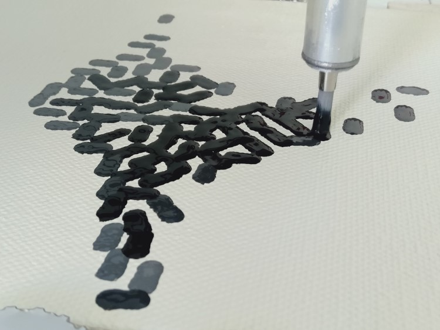

---
title: Styles
layout: default
filename: styles
order: 3
--- 

## Painting Styles

One of my interests for the project is to explore what styles can be painted 
using computer controlled brushes. Styles are affected by all stages of the 
painting process including choice of template photo, paint colors, changes in 
the digital painting software, and different types of brushes.   

    

   

## Line brush   

The line brush was the first method that I used for the project. This method 
uses simple linear brush strokes that are not overlapping. 

## Mazing brush   

The mazing brush is the second method that that I tried, which also uses brush 
strokes that are not overlapping. This method is different to the line brush 
method though, as the brush strokes are generated by a maze pattern generated to 
match the template image. depending on the brush size the maze can either be 
visible or hidden inside the paint.   
   

   

   
   
## Hertzmann brush   
   
The latest method I am working on is the hertzmann brush method. This is a 
method based on digital painting algorithm from the late 1980's. Unlike the 
previous two methods, this method is able to generate overlapping paint strokes.   
   

   

   