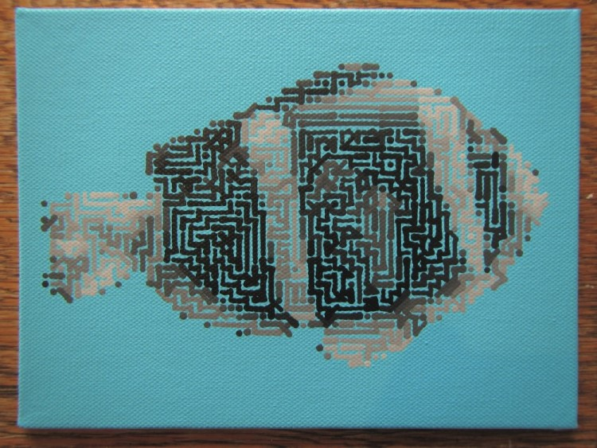

---
title: Styles
layout: default
filename: styles
order: 2
--- 

# Painting styles and methods

One of my interests for the project is to explore what styles can be painted 
using this combination of technology. While the technology is limited compared 
to human painting in some ways it is able to do other things that humans 
struggle with. Exploring this is one of the creative aspects of this project.

One style that emerged early in the project was the "mazing" style. A maze-like 
pattern is generated by the digital methods to fill in the areas of a canvas. If 
a slightly smaller brush is used in real-life then the maze pattern can be seen 
on the final canvas. This method represents a perfect blend of the artistic and 
technical aspects of the project.

  
   

   
   